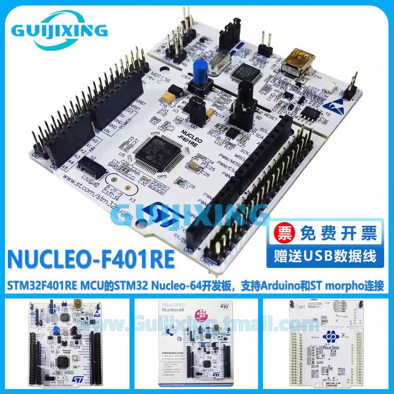
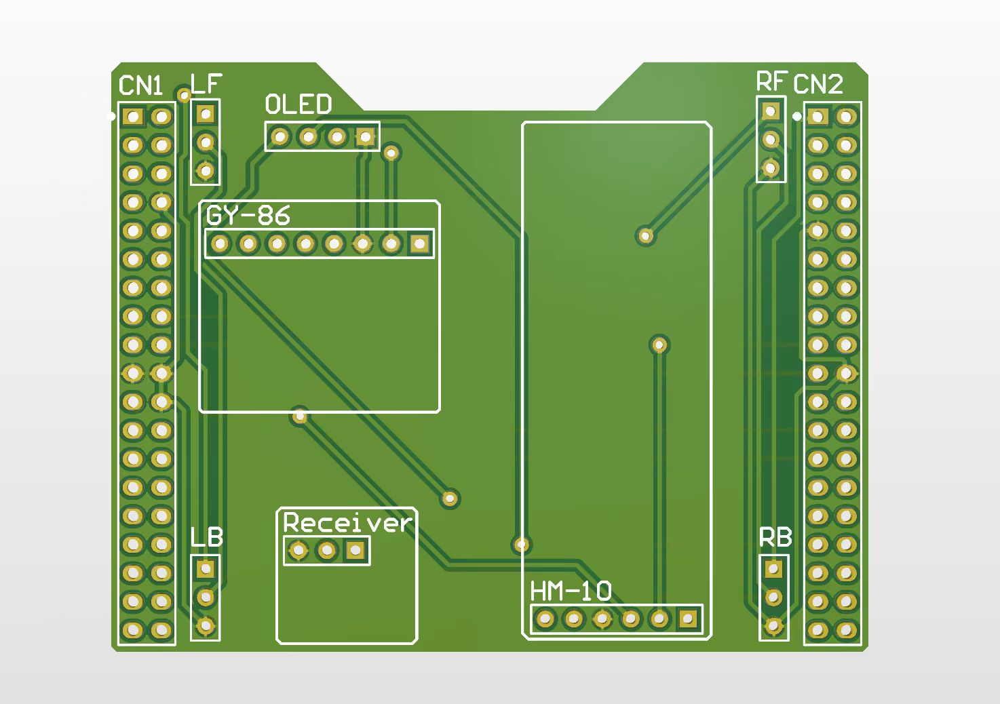
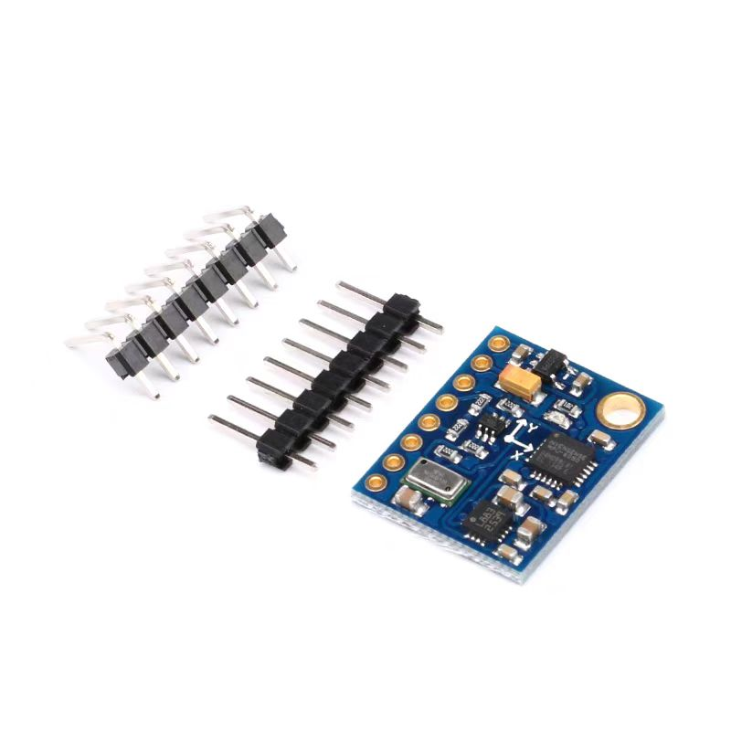
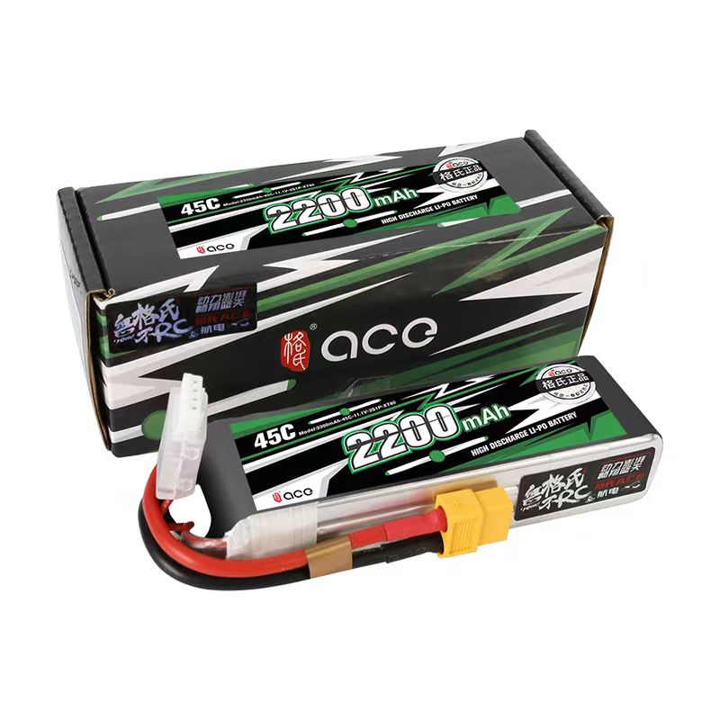
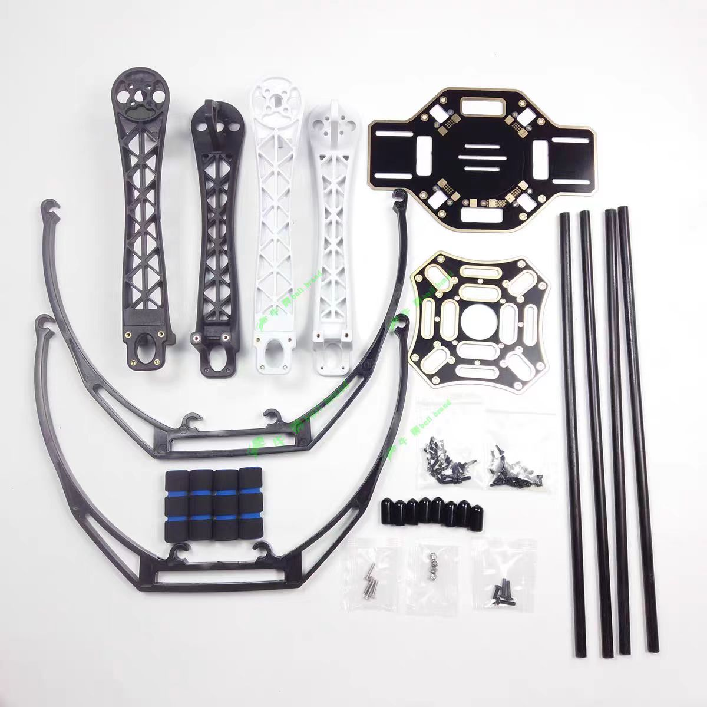
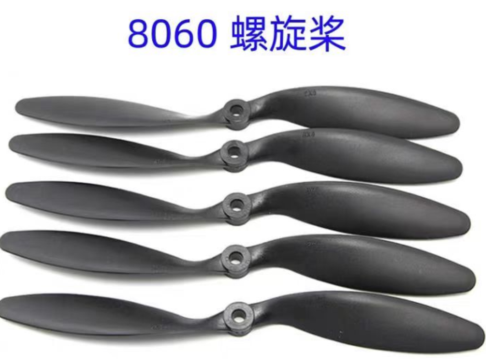
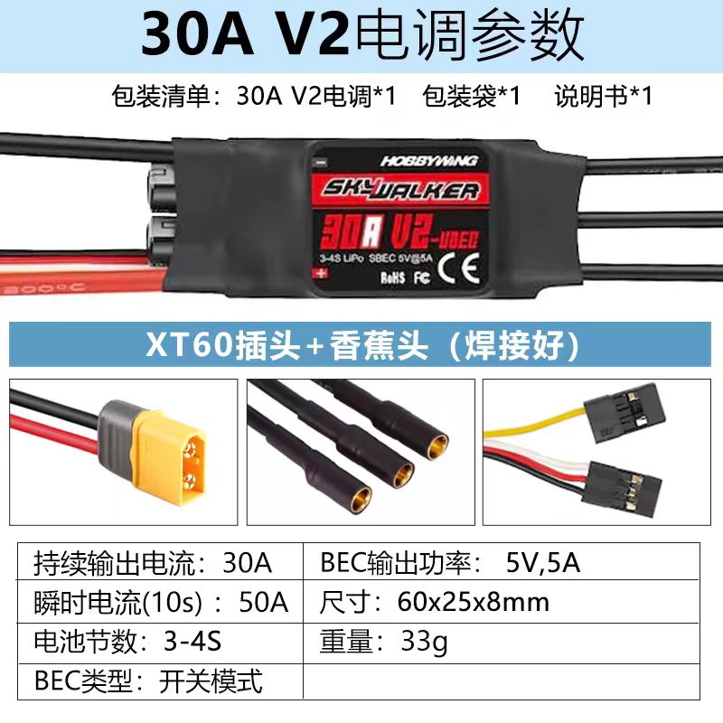
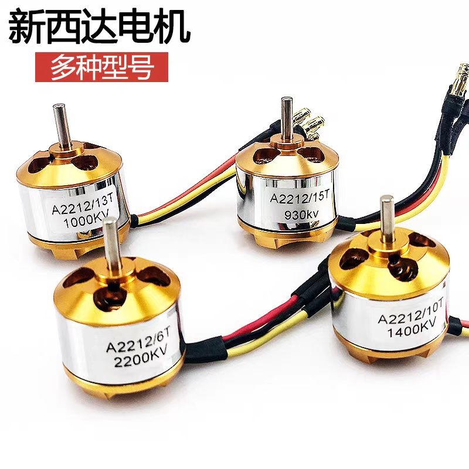

# 四旋翼飞行器

该工程包含飞控源码、转接板pcb文件

## quick start

### 准备材料：

**1、STM32F401RET6开发板（NUCLEO）**

链接：https://item.taobao.com/item.htm?id=675328947108

**2、转接板（需要自行打板，已提供pcb文件）**

**3、GY-86模块**

链接：https://item.taobao.com/item.htm?id=673922806605

**4、遥控器、接收机**

链接：https://item.taobao.com/item.htm?id=679604793806

**5、电池**

链接：https://item.taobao.com/item.htm?id=561802503149

**6、全套机架**

链接：https://item.taobao.com/item.htm?id=625527674861

**7、螺旋桨**

链接：https://item.taobao.com/item.htm?id=724833970953

**8、电调**

链接：https://item.taobao.com/item.htm?id=718634825354

**9、电机**

链接：https://item.taobao.com/item.htm?id=14538483825

**10、杜邦线若干**

**11、pcb打板说明**

打板文件为Connector/GSX.PcbDoc，使用嘉立创打板。

## 演示视频：

### 实飞：

链接：https://www.bilibili.com/video/BV1tG411671j/

### PID调参（双环）：

链接：https://www.bilibili.com/video/BV1Qb4y137Jw/

### PID调参（单环）：

链接：https://www.bilibili.com/video/BV1CN4y1s74W/

### 姿态解算测试：

链接：https://www.bilibili.com/video/BV1xe411i7fQ/

